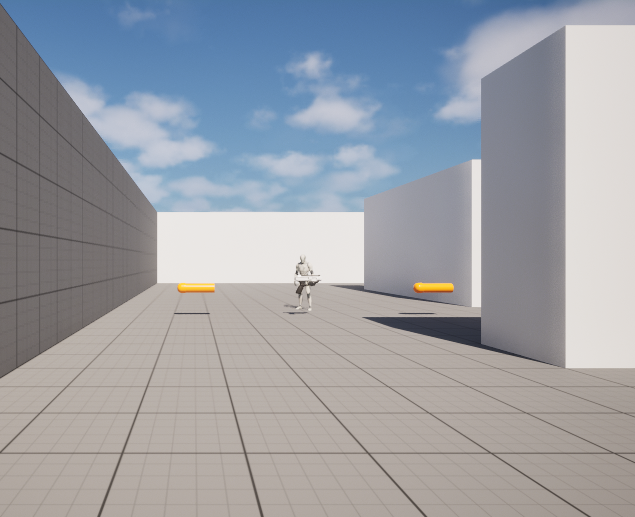
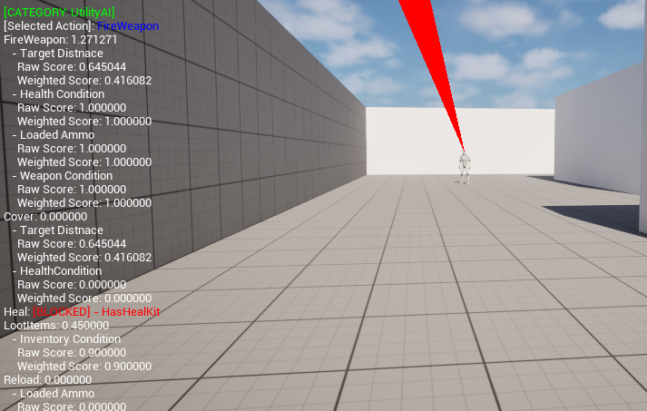
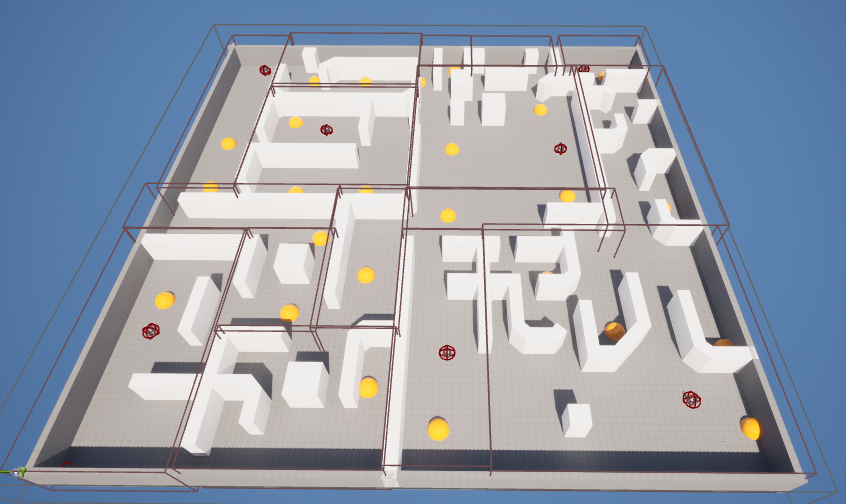

  

<h1 align="center"> Project Alpha </h1>

A first-person <strong>looter shooter</strong> built with <strong>Unreal Engine 5.6</strong>, featuring AI enemies driven by a data-driven <strong>Utility</strong> AI system designed to make NPCs behave like human players — fighting, taking cover, looting, healing, and retreating based on scored decisions.

  
  
  

---

## Utility AI Decision Making

  

Enemies evaluate actions (Attack, Cover, Loot, Heal, Reload, Escape) every few seconds through a time-sliced world subsystem, so many AI agents can decide without frame hitches.
Enemies evaluate every possible action through scored **considerations** — each score passes through a selectable response curve (Linear, Power, Root, and inverse variants) and is multiplied together.
Decisions and considerations are **DataAssets** (`UAiDecision` / `UAiConsideration`), configurable instance in the editor without touching code.

A custom `UtilityAI` **gameplay debugger** category overlays live decision scores on any enemy — shown above.

## Spatial Memory

  

level-placed `ARegionArea` volumes track known enemies, items, and visit times. AI uses a region graph (`URegionAreaSubsystem`) to score area danger and pick loot/search destinations.

## Under the Hood

- **Shared character base** — shared character base (`AFirstPersonBase`) for both the player and AI enemies, with health, inventory, and equipment slot components.
- **TIme-sliced world subsystem** — many AI agents decide every few seconds without frame hitches.
- **Perception-based targeting** — enemies track visible targets, damage causers, and spotted items via `UAIPerceptionComponent`, feeding both behavior tree services and utility scoring.
- **Item & inventory system** — DataAsset-defined items (weapons, heal kits) with world pickups, loot boxes, and a slot-based inventory usable by the player and AI alike.

---

## Requirements

- **Unreal Engine 5.6**
- **Visual Studio 2022** with C++ game development workload (Windows)
- Enabled plugins: StateTree, GameplayStateTree, ModelingToolsEditorMode

---

## Getting Started

1. Clone the repository.
2. Right-click `ProjectAlpha.uproject` → **Generate Visual Studio project files**.
3. Build from the IDE, or via Unreal Build Tool:
4. Open `ProjectAlpha.uproject` in the editor and hit Play.

---

## Project Status

Work in progress
